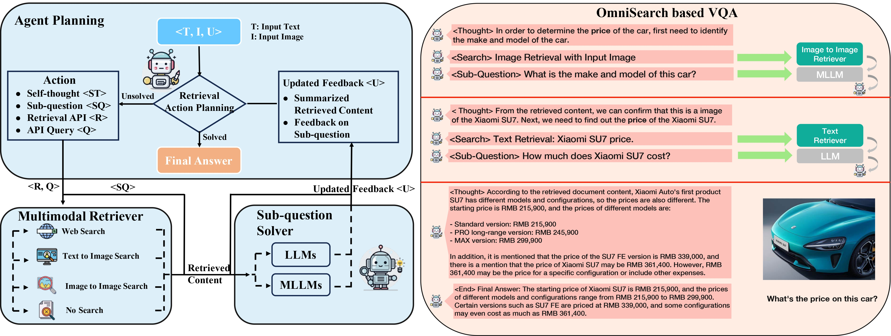
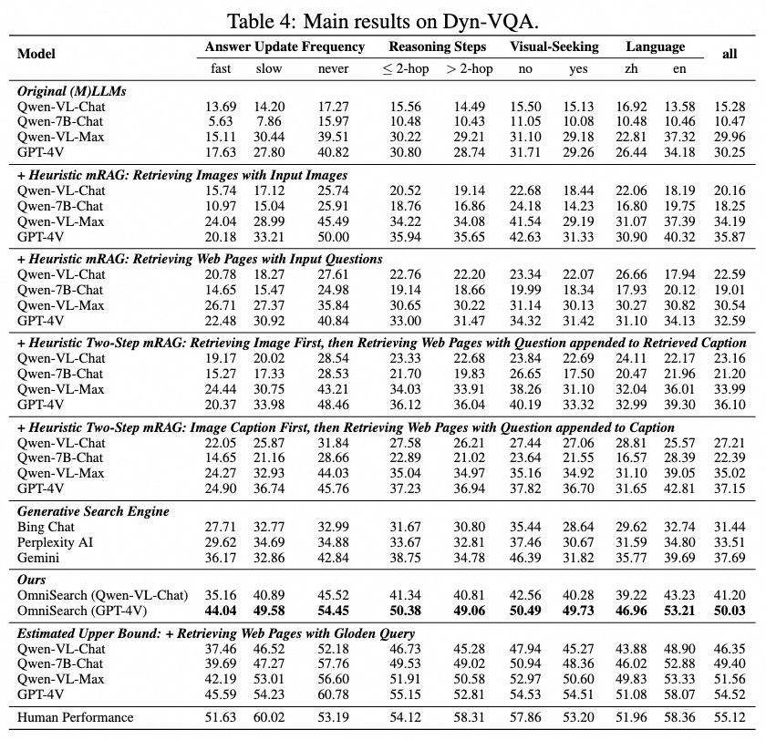

<div align="center">

</div>

# A Self-Adaptive Planning Agent For Multimodal RAG

[](https://pytorch.org/)[](https://arxiv.org/abs/2411.02937)

Repo for [*Benchmarking Multimodal Retrieval Augmented Generation with Dynamic VQA Dataset and Self-adaptive Planning Agent*](https://arxiv.org/abs/2411.02937)

You can visit the Omnisearch homepage by clicking [*here!*](https://alibaba-nlp.github.io/OmniSearch/)

🌏 The **Chinese Web Demo** is avaiable at [ModelScope](https://modelscope.cn/studios/iic/OmniSearch/summary?header=default&fullWidth=false) now！


- We propose OmniSearch, a self-adaptive retrieval agent that plans each retrieval action in real-time according to question solution stage and current retrieval content. As far as we known, **OmniSearch is the first planning agent for multimodal RAG.**
- We reveal that existing VQA-based mRAG benchmarks fail to reflect the feature that real-world questions require dynamic knowledge retrieval, and propose novel **Dyn-VQA dataset, which contains three types of dynamic questions.**
- We **benchmark various mRAG methods** with leading MLLMs on Dyn-VQA, demonstrating their flaw in providing sufficient and relevant knowledge for dynamic questions.


<div align="center">
    
</div>


## 💡 Perfomance

The performance of various MLLMs with different mRAG strategies are shown below:

<div align="center">
    
</div>

More analysis experiments can be found in the paper.

# 📚 Dyn-VQA Dataset

The json item of Dyn-VQA dataset is organized in the following format:
```json
{
    "image_url": "https://www.pcarmarket.com/static/media/uploads/galleries/photos/uploads/galleries/22387-pasewark-1986-porsche-944/.thumbnails/IMG_7102.JPG.jpg/IMG_7102.JPG-tiny-2048x0-0.5x0.jpg",
    "question": "What is the model of car from this brand?",
    "question_id": 'qid',
    "answer": ["保时捷 944", "Porsche 944."]
}
```

🔥 The Dyn-VQA **will be updated regularly.** Laset version: 202412.

# 🛠 Dependencies

```bash
pip install -r requirement.txt
```

#### Details

- Python = 3.11.9
- [PyTorch](http://pytorch.org/) (>= 2.0.0)
- pillow = 10.4.0
- requests = 2.32.3
- google-search-results = 2.4.2
- serpapi = 0.1.5

# 💻 Running OmniSearch

- GPT-4V-based OmniSearch

We have release the code of GPT-4V-based OmniSearch for English questions.

Before running, please replace with your own OPENAI key and Google_search key. OPENAI key is at 11-th line of main.py 

```python
GPT_API_KEY = "your_actual_key_here"
headers = {
    "Authorization": f"Bearer {GPT_API_KEY}"
}
```

Google_search key is at 10-th line of search_api.py

```python
API_KEY = "your api-key"
```

The result is saved to the path:

```python
output_path = os.path.join(meta_save_path, dataset_name, "output_from_gpt4v.jsonl")
```

Run the `main.py` file:

```bash
python main.py --test_dataset 'path/to/dataset.jsonl' --dataset_name NAME --meta_save_path 'path/to/results'
```

- Qwen-VL-based OmniSearch

We have made the [training data](https://github.com/Alibaba-NLP/OmniSearch/tree/main/dataset/training_data) for Qwen-VL-based OmniSearch publicly available. This data, along with the [CogVLM dataset](https://modelscope.cn/datasets/ZhipuAI/CogVLM-SFT-311K), was used to jointly train the [Qwen-VL-Chat](https://www.modelscope.cn/models/Qwen/Qwen-VL-Chat) using the [SWIFT framework](https://github.com/modelscope/ms-swift). The training script can be executed as follows:

```
swift sft --model_type qwen-vl-chat --dataset /Data/Path/to/Training_data_1 /Data/Path/to/Training_data_2 --model_id_or_path /Model/Path/to/Qwen-VL-Chat/ --output_dir /Output/Model/Path --max_length 8192 --evaluation_strategy 'no'
```

You can download the model from [OmniSearch-Qwen-VL-Chat-en on Hugging Face](https://huggingface.co/Alibaba-NLP/OmniSearch-Qwen-VL-Chat-en/tree/main).

Run the test script.  Run the `Omnisearch_qwen.py` file:

```bash
python Omnisearch_qwen.py --test_dataset '/path/to/dataset.jsonl' --dataset_name NAME --meta_save_path '/path/to/results' --model_path '/local/path/to/OmniSearch-Qwen-Chat-VL-weight'
```


# 🔍 Evaluation

The evaluation script for token F1-Recall of the output answers can be used as follows:

```bash
python evaluate.py --evaluate_file_path [path to output jsonl file] --lang [language of the
 QA dateset: en/zh]
```

## 🔥 TODO

- Release code for Qwen-VL-Chat based OmniSearch
- Release the corresponding model weight
- Create a benchmark for Dyn-VQA

## 📄 Acknowledge

- The repo is contributed by Xinyu Wang, Shuo Guo, Zhen Zhang and Yangning Li. 
- This work was inspired by ReACT, SelfAsk, FleshLLMs. Sincere thanks for their efforts. 

## 📝 Citation

```bigquery
@article{li2024benchmarkingmultimodalretrievalaugmented,
      title={Benchmarking Multimodal Retrieval Augmented Generation with Dynamic VQA Dataset and Self-adaptive Planning Agent}, 
      author={Yangning Li and Yinghui Li and Xinyu Wang and Yong Jiang and Zhen Zhang and Xinran Zheng and Hui Wang and Hai-Tao Zheng and Pengjun Xie and Philip S. Yu and Fei Huang and Jingren Zhou},
      year={2024},
      eprint={2411.02937},
      archivePrefix={arXiv},
      primaryClass={cs.CL},
      url={https://arxiv.org/abs/2411.02937}, 
}
```


When citing our work, please kindly consider citing the original papers. The relevant citation information is listed here.
